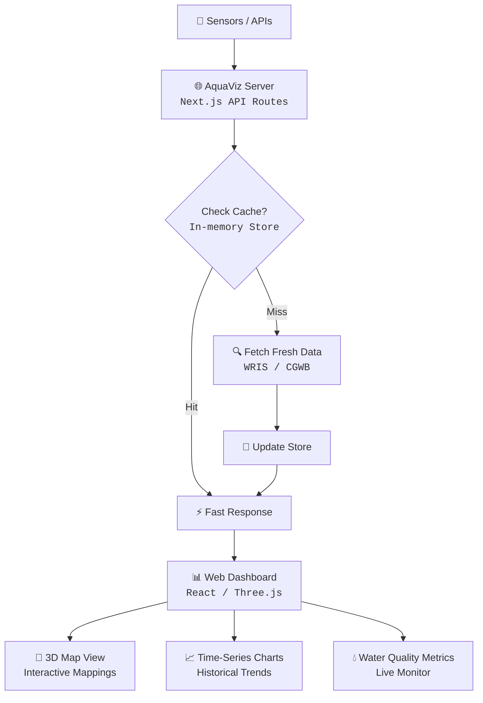

# AquaViz — Groundwater Visualization Platform v1.0

**Production-Grade Real-Time Groundwater Monitoring and Analytics**

A comprehensive, real-time groundwater monitoring and visualization platform. It integrates interactive historical data visualization, 3D mapping, and real-time sensor data from sources like India WRIS and CGWB to provide actionable insights into water quality and levels.

---

## Table of Contents

- [System Architecture](#system-architecture)
- [Data Integration Pipeline](#data-integration-pipeline)
- [Project Structure](#project-structure)
- [Quick Start](#quick-start)
- [Data Sources Configuration](#data-sources-configuration)
- [Deployment](#deployment)
- [Monitoring & Dashboards](#monitoring--dashboards)
- [Fault Tolerance](#fault-tolerance)
- [Future Scope](#future-scope)
- [Tech Stack](#tech-stack)
- [Author](#author)
- [License](#license)

---

## System Architecture



### Data Flow Summary

```
Data Sources (India WRIS, CGWB)
     │
     ▼
API Integration Layer (Next.js Routes) ──── Cache & Rate Limiting
     │
     ▼
In-Memory Data Store ──── CRUD Operations & Synchronization
     │
     ▼
Frontend Components (React)
  ├── 3D Map View (Three.js overlay)
  ├── Time-Series Charts (Recharts / Chart.js)
  └── Live Monitor Cards (Water Levels, Purity, Flow)
     │
     ▼
User Dashboard ──── Interactive Analysis & Export
```

---

## Data Integration Pipeline

### Stage 1 — Government Data Extraction
The platform seamlessly pulls data from **India WRIS** ArcGIS analytical services and API endpoints. 
- Retrieves water levels, historical trends, and quality metrics.
- Authenticates and processes secure API payloads into normalized JSON for the application.

### Stage 2 — Sensor Data Ingestion
Custom sensors and local monitoring stations can push data into the application via secure endpoints.
- **Water Level**: Tracks depletion and refill metrics live.
- **Water Quality**: Tracks pH, TDS, and other vital chemical parameters.

### Stage 3 — Aggregation & Voting
When multiple sources report on the same geographical region, AquaViz uses aggregation algorithms to provide the most accurate reading, relying on historical trust scores and timestamp validation.

---

## Project Structure

```
groundwater-viz/
├── src/
│   ├── app/                 # Next.js App Router (Pages & Layouts)
│   ├── api/                 # Backend API routes for WRIS, Admin, Rainfall
│   ├── components/          # Reusable React components (Dashboard, Maps)
│   └── lib/                 # In-memory store, utilities, and sensor logic
├── public/                  # Static assets (images, html)
├── .gitignore               # Git exclusions
├── package.json             # Node dependencies and scripts
└── README.md                # Project documentation
```

---

## Quick Start

### 1. Install Dependencies

```bash
npm install
```

### 2. Configure Environment

Review your environment variables or local configurations if specific API keys are needed for WRIS / CGWB access.

### 3. Run Development Server

```bash
npm run dev
# or yarn dev / pnpm dev
```

### 4. Access the Platform

Open [http://localhost:3000](http://localhost:3000) with your browser to see the dashboard.

---

## Data Sources Configuration

The application aggregates multiple metrics based on distinct modules:

| Source | Feature | Refresh Rate | Reliability Focus |
|---|---|---|---|
| **India WRIS** | National Groundwater Levels | Daily | Historical coverage |
| **CGWB API** | Regional Quality Reports | Weekly | Accurate chemical analysis |
| **Live Sensors** | Local Monitoring Stations | Every 5 mins | Low-latency alerts |

---

## Deployment

### Vercel Deployment (Recommended)

1. Connect your GitHub repository to Vercel.
2. Select the `groundwater-viz` project.
3. Configure build commands (`npm run build`).
4. Deploy with one click.

---

## Monitoring & Dashboards

**Live Monitor Dashboard:**
- Tracks groundwater levels and water quality metrics live.
- Interactive alerts for critical water levels.

**Interactive 3D Mappings:**
- Visualizes data geographically using Three.js and dynamic maps for better regional understanding.

---

## Fault Tolerance

| Failure | Behavior |
|---|---|
| API Source disconnect | Returns last cached data from In-Memory store |
| Sensor malfunction | Flags sensor data as "Stale" if no updates inside 15 min |
| UI Rendering Error | React Error Boundaries trap the error and keep the rest of the dashboard alive |

---

## Future Scope

### Multi-State Rollout
Expanding the API ingestion to support distinct state-level portals beyond the central WRIS database.

### AI Prediction Models
Implementing machine learning to predict water scarcity based on historical rainfall and current extraction rates.

---

## Tech Stack

| Component | Technology |
|---|---|
| Frontend Framework | Next.js (App Router) |
| UI Library | React |
| 3D Rendering | Three.js |
| Styling | CSS Modules |
| Backend API | Next.js Route Handlers |
| Data Store | In-memory Object Store |

---

## Author

**Adesh** — AquaViz Project

---

## License

For academic and research purposes.
